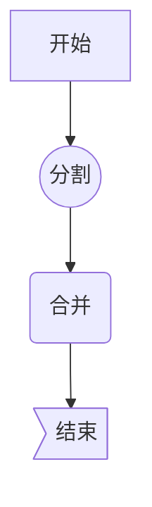
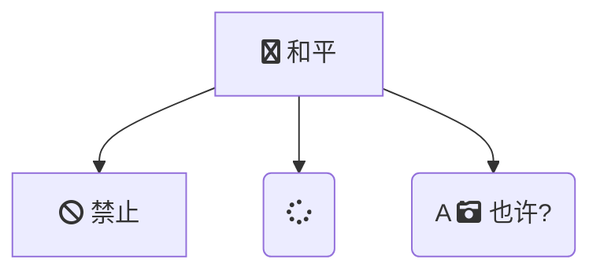

[mermaid](https://mermaidjs.github.io/) 是一个工具

```reStructuredText
Generation of diagrams and flowcharts from text in a similar manner as markdown
```

##  基本用法 ##

### 图形 ###


表示方向

| 缩写 | 含义     |
| ---- | -------- |
| TB   | 从上到下 |
| BT   | 从下到上 |
| RL   | 从右到左 |
| LR   | 从左到右 |
| TD   | 与TB相同 |

### 节点和形状 ###



| 类别             |                |
| ---------------- | -------------- |
| start            | 默认文本节点   |
| start[开始]      | 文本节点       |
| start(开始)      | 圆边节点       |
| start((开始))    | 圆形节点       |
| start>开始]      | 非对称形状     |
| start{开始}      | 菱形节点       |
| A --> B          | 带箭头的连接   |
| A --- B          | 无箭头的连接   |
| A-.->B           | 虚线           |
| A ==> B          | 粗连接         |
| A -- 指向 --> B  | 连接注释       |
| A -- 指向 -- B   | 连接注释       |
| A -->\|指向\| B  |                |
| A -- \|指向\|B   |                |
| A-. 注释 .->B    | 虚线           |
| A ==  注释 ==> B | 带文本的粗连接 |

### 子图 ###


```
subgraph title
    graph definition
end
```




```
https://oapi.dingtalk.com/robot/send?access_token=59b5d1299b103993190c9571bbe9659864e1cb96fe44cfa70b35a520cb274fb1

SEC59691c18060a1af0c89bbc842254af3b401ba26b6b02206ade78a901307786ca
```


## 参考资料 ##

https://www.jianshu.com/p/af48cc77b57a

https://sspai.com/post/63055